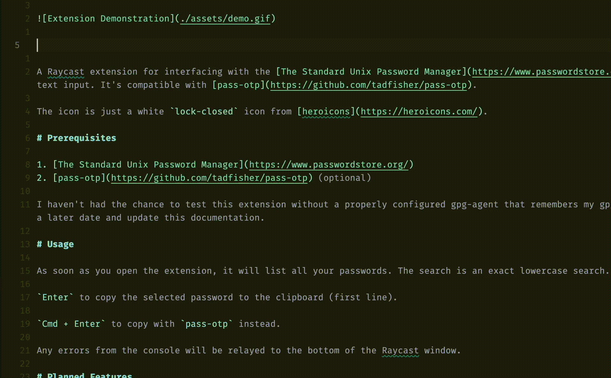

# Pass Extension for Raycast

A Raycast extension for interfacing with the [The Standard Unix Password Manager](https://www.passwordstore.org/) from the comfort of your floating text input. It's compatible with [pass-otp](https://github.com/tadfisher/pass-otp).

# Prerequisites

1. [The Standard Unix Password Manager](https://www.passwordstore.org/)
2. [pass-otp](https://github.com/tadfisher/pass-otp) (optional)

I haven't had the chance to test this extension without a properly configured gpg-agent that remembers my gpg key password. I'll test this scenario at a later date and update this documentation.

# Usage

As soon as you open the extension, it will list all your passwords. The search is an exact lowercase search.

`Enter` to copy the selected password to the clipboard (first line).

`Cmd + Enter` to copy with `pass-otp` instead.

Any errors from the console will be relayed to the bottom of the Raycast window.

# Planned Features

- [ ] Support for creating/inserting new passwords into the password store.
- [ ] A way to sort by most frequently used passwords on top of alphabetically.
